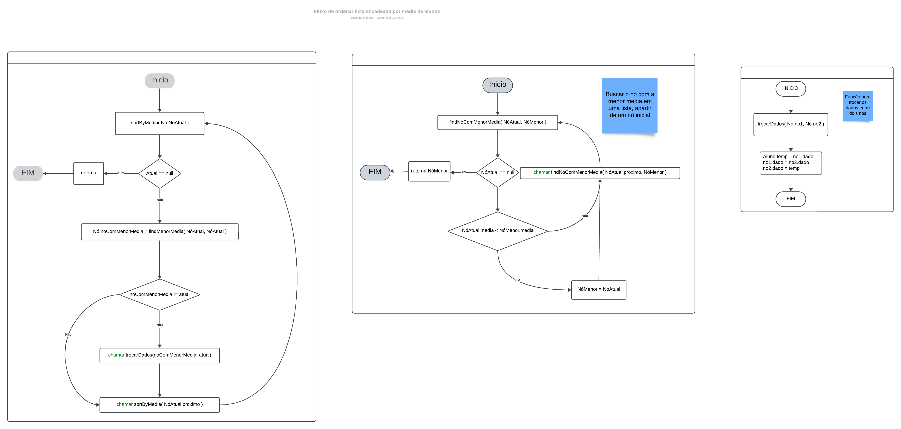
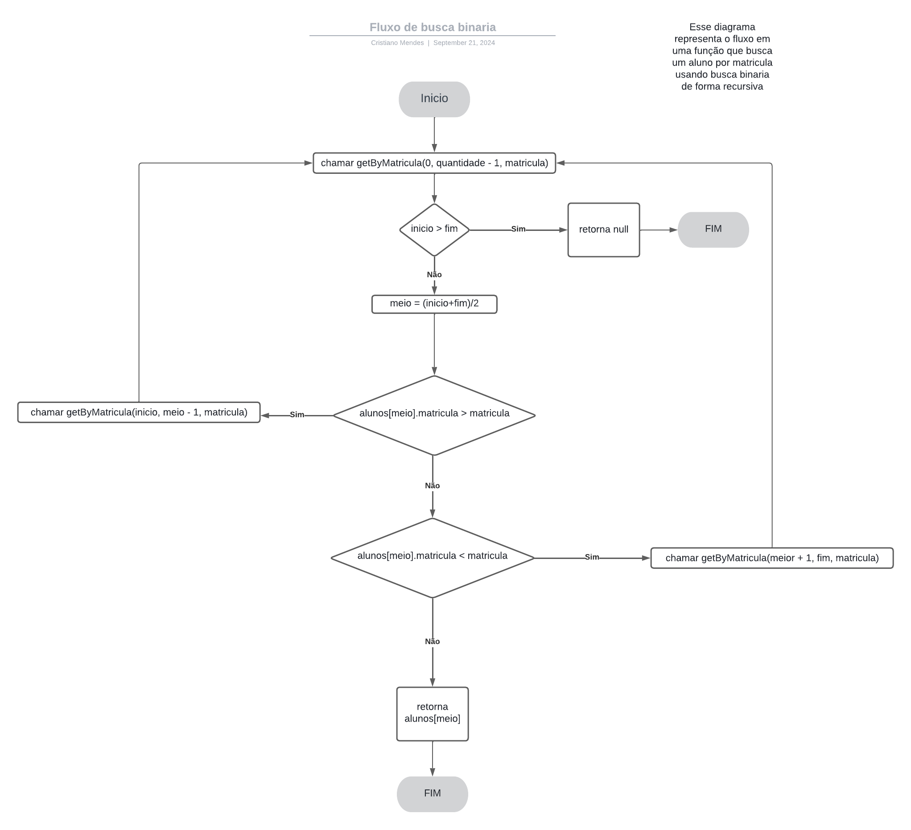

# **TP Estrutura de dados 2024.1**

## Tópicos
  - [Estrutura de Dados Adotada](#estrutura-de-dados-adotada)
  - [Tarefas](#tarefas)
  - [Algoritmos Utilizados](#algoritmos-utilizados)
  - [Diagramas](#diagramas)

Este trabalho prático tem como objetivo implementar e manipular uma estrutura de dados personalizada para armazenar informações de alunos de uma turma. O projeto envolve operações básicas de inclusão, remoção, listagem e ordenação de alunos, além da busca eficiente por matrícula.

## **Estrutura de Dados Adotada**

Para este projeto, foi adotada uma **lista encadeada** como estrutura de dados. Cada nó da lista armazena as informações de um aluno (matrícula, nome e média final) e um ponteiro para o próximo nó da lista. Esta estrutura foi escolhida porque permite a inserção e remoção eficiente de elementos, especialmente quando há muitas operações de modificação no meio da lista.

### **Vantagens da Lista Encadeada:**
- **Inserção/Remoção eficiente:** A inserção ou remoção de nós pode ser feita em tempo constante (O(1)) se a posição do nó for conhecida.
- **Flexibilidade de Tamanho:** A lista encadeada pode crescer ou encolher dinamicamente sem a necessidade de realocação de memória.
- **Busca:** A busca pode ser feita linearmente (O(n)), mas uma otimização adicional será feita com a busca binária após a ordenação.

## **Tarefas**

### **1. Estrutura de Dados para Alunos**
- [x] **Concluído**

Crie uma estrutura de dados para armazenar informações sobre alunos. Cada aluno deve conter as seguintes informações:

- Matrícula
- Nome
- Média final

A estrutura deve implementar as seguintes funcionalidades:

- Incluir novo aluno
- Remover aluno por matrícula
- Listar todos os alunos

---
### **2. Ordenar por Média Final**
- [x] **Concluído**

Implemente uma nova funcionalidade que ordene os alunos pela média final usando o algoritmo **SelectionSort** de forma recursiva.

---

### **3. Ordenar por Matrícula**
- [x] **Concluído**

Implemente a ordenação dos alunos por matrícula utilizando também o algoritmo **SelectionSort** recursivo.

---

### **4. Busca Binária por Matrícula**
- [x] **Em andamento**

Implemente uma busca binária recursiva para encontrar um aluno pela matrícula. Lembre-se de que os alunos devem estar ordenados por matrícula para que a busca funcione corretamente.

---

## Algoritmos Utilizados
### Selection Sort
O Selection Sort é um algoritmo de ordenação que percorre a lista, encontra o menor elemento e o coloca na posição correta. Ele continua repetindo esse processo para os elementos restantes. Embora simples, esse algoritmo tem complexidade de tempo O(n²), o que pode ser menos eficiente em grandes listas. Neste projeto, o Selection Sort foi implementado de forma recursiva para ordenar os alunos tanto pela média quanto pela matrícula.

### Busca Binária
A Busca Binária é um algoritmo de busca eficiente que funciona em tempo O(log n), desde que a lista esteja previamente ordenada. O algoritmo divide a lista pela metade em cada passo, verificando se o valor desejado está na parte esquerda ou direita, e continua reduzindo o espaço de busca. No caso deste projeto, após ordenar os alunos por matrícula, a busca binária será usada para localizar rapidamente um aluno específico.

---
## Diagramas
#### Ordenar alunos por media com `Selection-Sort`

> **Observação:** Segue a mesma estrutura para o metodo `ordenar por matricula`.

#### Buscar aluno por matricula com busca binaria recursiva
